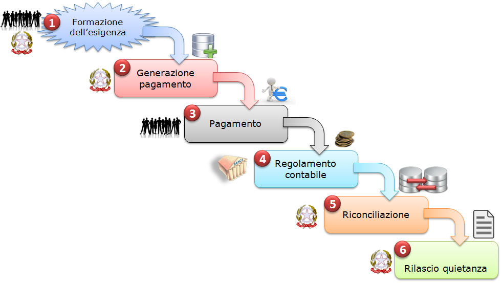
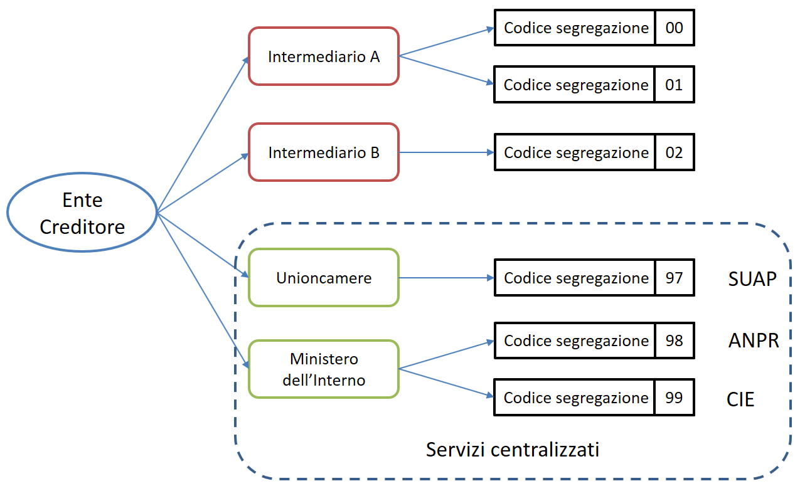

Ciclo di vita del pagamento
-----------------------------

Nell'ambito delle relazioni tra utilizzatore finale ed enti creditori, la necessità di effettuare pagamenti a favore di questi ultimi è sempre associata a procedimenti amministrativi che prevedono il rispetto di regole per il loro corretto svolgimento quali, ad esempio, la verifica di alcuni prerequisiti. Tali procedimenti danno infine luogo ad un pagamento che si articola sulla falsariga rappresentata in , che definiamo "Ciclo di vita" del pagamento.

In questa descrizione del "Ciclo di vita" del pagamento l'ordine delle fasi è indicativo e può variare a seconda dello scenario e della tipologia di servizio al quale si riferisce il pagamento stesso.

|image5|

Figura 1 - Ciclo di vita del pagamento

L'esigenza del pagamento può nascere sulla base di un bisogno dell'utilizzatore finale che necessita, ad esempio, di un servizio da parte dell'ente ovvero quando quest'ultimo deve richiedere all'utilizzatore finale l'estinzione di un debito creatosi nei suoi confronti: ad esempio il pagamento di una multa o di un'ammenda.

Questa esigenza si concretizza attraverso la generazione di un insieme di informazioni che l'Ente Creditore deve memorizzare in appositi archivi per la successiva fase di riconciliazione e che permettono l'effettuazione del pagamento stesso.

Una volta completata la fase di esecuzione del pagamento - attraverso le
procedure messe a disposizione dagli enti creditori o dai prestatori di
servizi di pagamento – si procede al regolamento contabile
dell'operazione tra i prestatori di servizi di pagamento, con modalità
diverse a seconda dello strumento di pagamento attraverso il quale viene
effettuato il versamento stesso, che determina anche le modalità di
riversamento presso il PSP dell'Ente Creditore.

Il ciclo di vita del pagamento si conclude con la riconciliazione dello
stesso presso l'Ente Creditore e con l'eventuale generazione della
quietanza da consegnare all'utilizzatore finale.

Tutto ciò premesso, il presente documento di ha lo scopo di precisare in
modo puntuale le attività che le pubbliche amministrazioni, i gestori di
pubblici servizi ed i prestatori di servizi di pagamento devono mettere
in atto per consentire l'effettuazione dei pagamenti elettronici da
parte degli utilizzatori finali.

In particolare, nella **Sezione I** sono definite: le attività legate
alla fase di generazione del pagamento, unitamente alle specifiche dei
codici da utilizzare per il versamento, ed il loro utilizzo nelle
transazioni interbancarie. Nella **Sezione II** sono descritte: le
modalità e le informazioni da utilizzare per la fase di regolamento
contabile e riversamento dei fondi, nonché le modalità con le quali
effettuare la riconciliazione dei pagamenti presso gli enti creditori.

Sezione I - Composizione dei codici per il versamento

In questa sezione saranno fornite indicazioni circa le modalità con cui
gli enti creditori devono mettere a disposizione e generare le
informazioni necessarie ad eseguire il pagamento; in particolare
tratteremo la "causale di versamento" che deve essere abbinata ad ogni
versamento effettuato a favore degli enti creditori stessi.

Per comodità e fluidità di esposizione nel seguito presenteremo in primo
luogo nel capitolo le regole con le quali l'Ente Creditore deve generare
il codice IUV (Identificativo Univoco di Versamento) necessario a
individuare il pagamento, mentre nel capitolo saranno esposte le regole
di composizione della causale che - ai sensi dell'articolo 5, comma 1,
lettera a), numero 2) del CAD - rappresenta il codice «\ *da indicare
obbligatoriamente per il versamento*\ ».

Da ultimo, nel capitolo , verranno indicate le regole base per la
composizione dell'operazione di trasferimento fondi, mentre nel capitolo
saranno date istruzioni per la riconciliazione dei pagamenti che non
sono oggetto di un riversamento cumulativo.

+---------------------------------------------+----+
| .. rubric:: Siti web Degli Enti Creditori   |    |
|    :name: siti-web-degli-enti-creditori     |    |
+---------------------------------------------+----+

Una volta manifestatasi l'esigenza del pagamento (vedi capitolo ""), gli
Enti Creditori devono consentire agli utilizzatori finali – a norma
dell'articolo 5, comma 1 del CAD - l'effettuazione del pagamento con
modalità elettronica: a tale scopo «… *a) sono tenuti* *a pubblicare*
*nei propri siti istituzionali e a specificare nelle richieste di
pagamento: …… 2) i codici identificativi del pagamento da indicare
obbligatoriamente per il versamento*\ ».

A tale scopo gli enti creditori mettono a disposizione le informazioni
per effettuare i pagamenti attraverso portali e siti web autenticati con
procedure di validazione avanzata (come, ad esempio, certificati SSL con
*Extended Validation* emessi da Autorità di Certificazione
riconosciute).

Le pagine di tali siti web, dedicate all'effettuazione dei pagamenti
devono esporre il logo del sistema pagoPA® per dare prova della
loro informatizzazione e promuovere i servizi di pagamento elettronici
offerti attraverso il Sistema.

Gli indirizzi internet dei servizi dedicati ai pagamenti devono essere
inoltre pubblicati sull'Indice delle Pubbliche Amministrazioni
(IPA [1]_) istituito con il DPCM del 31 ottobre 2000 recante le regole
tecniche per il protocollo informatico.

+---------------------------------------------------------------------+------------+
| .. rubric:: Generazione dell'Identificativo Univoco di Versamento   | |image6|   |
|    :name: generazione-dellidentificativo-univoco-di-versamento      |            |
+---------------------------------------------------------------------+------------+

Secondo quanto definito nel paragrafo 7.1 delle Linee guida, « *..., ciascun Ente Creditore attribuisce ad ogni operazione di incasso un codice identificativo denominato "Identificativo Univoco di Versamento" (IUV) che non può essere associato nel tempo ad alcun altro incasso emesso dal medesimo Ente Creditore .....*\ ».

Il codice IUV assume quindi una rilevanza fondamentale « ... *al fine di consentire le attività di riconciliazione del pagamento da parte degli Enti Creditori e quelle di riversamento a cura dei Prestatori di servizi di pagamento...* » rappresentando pertanto uno degli elementi essenziali sui quali si base il sistema pagoPA®.

Lo stesso paragrafo 7.1 delle Linee guida concede agli Enti Creditori la possibilità di « *.... demandare ad un soggetto terzo, in tutto o in parte, la generazione dell'Identificativo Univoco di Versamento, *curando che ne sia mantenuta l'univocità nel tempo**\ ».

+----------------------------------------+----+
| .. rubric:: Struttura del Codice IUV   |    |
|    :name: struttura-del-codice-iuv     |    |
+----------------------------------------+----+

La generazione di un codice IUV che risulti ***univoco*** nel corso del tempo è una responsabilità in capo all'Ente Creditore, che è libero di strutturarne la composizione secondo le proprie esigenze, facendo attenzione che tale codifica sia conforme agli standard internazionali esistenti e tenga conto in prima istanza della natura del pagamento (dovuto o spontaneo) ed in seconda istanza del numero dei "punti di generazione" del codice stesso.

Natura del pagamento
---------------------

Come indicato nel capitolo 2 delle SANP (Allegato B alle Linee guida), gli incassi che un Ente Creditore deve gestire possono essere distinti secondo due diverse modalità:

-  su iniziativa dell'Ente Creditore (o dovuti): è il caso in cui l'ente, attraverso un avviso (analogico o digitale), richiede un pagamento all'utilizzatore finale;

-  su iniziativa del debitore (o spontanei): nei quali l'utilizzatore finale - che deve effettuare, a vario titolo, un versamento a favore dell'ente - si attiva in via autonoma.

Nel primo caso (avviso analogico o digitale), in cui il pagamento può essere eseguito attraverso i canali messi a disposizione dai PSP.

Nella seconda eventualità, associata ai pagamenti attivati preso l'Ente Creditore, si rimanda al successivo. Si
tenga presente che, se l'utilizzatore finale decide di effettuare il pagamento in un tempo successivo e allo scopo richiede la stampa di un avviso analogico oppure l'invio di un avviso digitale, si ricade nel caso precedente.

Punti di generazione del codice IUV
-----------------------------------

Il sistema pagoPA® consente ad un Ente Creditore di utilizzare uno più intermediari e/o partner tecnologici: tale circostanza fa si che la generazione dello IUV possa avvenire in maniera indipendente presso più soggetti e possibilmente non sotto il controllo diretto dell'Ente Creditore.

Tale situazione può essere presente anche presso Enti Creditori dotati di un'organizzazione complessa e articolata in più unità autonome, che hanno la necessità di generare il codice IUV in maniera indipendente.

Definiamo quindi "punto di generazione del codice IUV" qualsiasi entità, facente parte o meno dell'organizzazione dell'Ente Creditore, incaricata da questo di associare un codice IUV ad un unico pagamento presente nell'archivio dei pagamenti in attesa di cui al capitole 7 delle Linee guida.

Il codice di segregazione
-------------------------

Tutto ciò premesso, è necessario definire delle regole affinché la codifica del pagamento risulti effettivamente univoca all'interno dell'Ente Creditore nel corso del tempo: questo risultato si ottiene associando ad ogni punto di generazione del codice IUV un particolare codice che serve a segregare i domini di gestione dei pagamenti dell'ente.

Tale codice viene denominato "codice di segregazione".

L'Agenzia per l'Italia Digitale attribuisce il codice di segregazione ad ogni punto di generazione del codice IUV in funzione del soggetto che svolge il ruolo di intermediario o partner tecnologico, secondo la seguente classificazione:

a. **Erogatori di servizi centralizzati**: intermediari tecnologici, riconosciuti da AgID, che erogano servizi in modalità accentrata a livello nazionale;

b. **Punti di generazione del Codice IUV**: qualsiasi intermediario o partner tecnologico che non rientra nella classificazione precedente, nonché le unità autonome dell'ente.

Uno schema delle modalità di attribuzione del Codice Segregazione è riportata in Figura 2.

|image7|

Figura 2 - Attribuzione del codice segregazione

Erogatori di servizi centralizzati
----------------------------------

Sono quei soggetti, censiti a livello generale, che erogano servizi centralizzati per una comunità di Enti Creditori con riferimento a procedure specifiche: quali, ad esempio, il SUAP, l'emissione on-line della Carta di Identità Elettronica, l'emissione dei certificati anagrafici tramite ANPR, ecc.

In alcuni casi - come ad esempio quello legato all'emissione on-line della CIE o dei certificati anagrafici, che consentono di effettuare contestualmente il pagamento del servizio - l'utilizzo della procedura centralizzata sarà obbligatorio per tutti i comuni italiani.

L'attribuzione della qualifica di erogatore di servizi centralizzati deve essere richiesta all'AgID che provvederà ad aggiornare l'elenco riportato in .

\ **Tabella 1 - Elenco servizi centralizzati**

+---------------------------+------------------------------------------+-------------------------------------+
| **codice segregazione**   |     **Soggetto che eroga il servizio**   |     **Servizio**                    |
+===========================+==========================================+=====================================+
| 99                        |     Ministero dell'Interno               |     Emissione on-line CIE           |
+---------------------------+------------------------------------------+-------------------------------------+
| 98                        |     Ministero dell'Interno               |     Emissione certificati da ANPR   |
+---------------------------+------------------------------------------+-------------------------------------+
| 97                        |     Unioncamere                          |     SUAP                            |
+---------------------------+------------------------------------------+-------------------------------------+

Punti di generazione del codice IUV
-----------------------------------

AgID attribuirà uno o più codici segregazione (progressivamente a salire: da 00 a 49) ad ognuno degli intermediari/partner tecnologici, ovvero entità autonome dell'Ente Creditore, secondo quanto da questi richiesto.

Se un Ente Creditore genera in proprio attraverso entità autonome il codice IUV e si avvale contemporaneamente di un intermediario o di un partner tecnologico, le entità autonome dovranno essere censite alla stregua di intermediario/partner dello stesso ente.

Numero avviso e codice IUV nel caso di pagamenti attivati presso i PSP
----------------------------------------------------------------------

Nel caso dei pagamenti attivati presso il PSP è sempre presente un
avviso di pagamento (analogico o digitale) al quale è associato un
Numero Avviso che contiene al suo interno il codice IUV. La struttura
del Numero Avviso [2]_ è specificata dallo schema (A), dove i componenti
indicati assumono il seguente significato:

<aux digit (1n)>[<application code> (2n)]<codice IUV (15\|17n)>  (A)

+-------------------------------------------------------------------+--------------------------------------------------------------------------------------------------------------------------------------------------------------------------------------------------------------------------------------------+
|                               |                                                                                                                                                                                                                                                                                |
+===================================================================+============================================================================================================================================================================================================================================+
|     **aux digit**             | Valore numerico che definisce la struttura del codice IUV in funzione del numero di punti di generazione dello stesso (vedi a pagina 15);                                                                                                                                      |
+-------------------------------------------------------------------+--------------------------------------------------------------------------------------------------------------------------------------------------------------------------------------------------------------------------------------------+
|     **application code**      | Valore numerico che serve ad individuare la porzione dell'archivio dei pagamenti in attesa interessata dall'operazione [3]_. Il dato è presente o meno in funzione del componente <aux digit> (vedi a pagina 15);                                                              |
+-------------------------------------------------------------------+--------------------------------------------------------------------------------------------------------------------------------------------------------------------------------------------------------------------------------------------+
|     **codice IUV**            | Rappresenta l'identificativo univoco di versamento, così come definito nel paragrafo 7.1 delle Linee guida. Ad un singolo pagamento in attesa può essere associato uno ed un solo codice IUV, indipendentemente dai possibili diversi strumenti messi a disposizioni dal PSP.  |
|                               |                                                                                                                                                                                                                                                                                |
|                               | Per la struttura del codice IUV si vedano i paragrafi successivi.                                                                                                                                                                                                              |
+-------------------------------------------------------------------+--------------------------------------------------------------------------------------------------------------------------------------------------------------------------------------------------------------------------------------------+

Si noti come, nella rappresentazione del precedente schema e di quelli
successivi, i componenti all'interno delle parentesi quadre possano non
essere presenti nell'oggetto, mentre il carattere "\|" indichi la
presenza in alternativa dei vari componenti oppure i possibili valori
che può assumere la lunghezza del componente stesso.

Composizione del codice IUV
~~~~~~~~~~~~~~~~~~~~~~~~~~~

La composizione del **codice IUV** è rappresentata dallo schema (B) come concatenazione dei suoi componenti, che assumono il seguente significato:

    ``[<Codice segregazione (2n)>]<IUV base (13\|15\|17n)>[<IUV check digit (2n)]>``   (B)

	
- **Codice segregazione** : valore numerico che rappresenta il **Codice di Segregazione**. Il componente è presente o meno nella struttura del codice IUV in funzione del componente <aux digit> del Numero Avviso.
- **IUV base** : valore numerico che ogni Ente Creditore è libero di strutturare secondo le proprie esigenze, nei limiti indicati dalle presenti specifiche attuative. Il componente assume una lunghezza variabile in funzione del componente <aux digit> del Numero Avviso.
- **IUV check digit** : Rappresenta il codice di controllo dello IUV, calcolato con l'algoritmo precisato nei paragrafi successivi. Il componente è presente o meno nella struttura del codice IUV in funzione del componente <aux digit> del Numero Avviso.

	
La previsione del carattere di controllo dello IUV (<IUV check digit>)
non comporta per il PSP l'obbligo bensì la facoltà di verifica,
consentendo al PSP stesso di controllare il Numero Avviso, con evidente
efficientamento del processo di pagamento in quanto evita
preventivamente la ricezione di risposte negative inviate dall'Ente
Creditore.

Generazione del Numero Avviso e del codice IUV
~~~~~~~~~~~~~~~~~~~~~~~~~~~~~~~~~~~~~~~~~~~~~~~

La necessità di gestire l'emissione del codice IUV presso più "punti di
generazione", nonché quella di trattare particolari situazioni in essere
presso gli Enti Creditori, viene realizzata attraverso l'assegnazione di
valori diversi al componente <aux digit> del Numero Avviso, cosi come
indicato in , dove i valori assegnati a tale componente determinano sia
la presenza, sia la lunghezza degli altri componenti del codice IUV e
del Numero Avviso.

\ **Tabella 2 - Composizione del codice avviso in funzione dei punti di
generazione dello IUV**

+-----------------------------+-------------------+--------------------------+-----------------------------+------------------+-------------------------+------------------+
| **Punti generazione IUV**   | **<aux digit>**   | **<application code>**   | **<codice segregazione>**   | **Lunghezza**    | **<IUV check digit>**   | **Lunghezza**    |
|                             |                   |                          |                             |                  |                         |                  |
|                             |                   |                          |                             | **<IUV base>**   |                         | **codice IUV**   |
+=============================+===================+==========================+=============================+==================+=========================+==================+
| 1                           | 0                 | si                       | no                          | 13               | si                      | 15               |
+-----------------------------+-------------------+--------------------------+-----------------------------+------------------+-------------------------+------------------+
| 1                           | 1                 | no                       | no                          | 17               | no                      | 17               |
+-----------------------------+-------------------+--------------------------+-----------------------------+------------------+-------------------------+------------------+
| ≥1                          | 2                 | no                       | no                          | 15               | si                      | 17               |
+-----------------------------+-------------------+--------------------------+-----------------------------+------------------+-------------------------+------------------+
| > 1                         | 3                 | no                       | si                          | 13               | si                      | 17               |
+-----------------------------+-------------------+--------------------------+-----------------------------+------------------+-------------------------+------------------+

Come si vede da un'analisi della , nei casi in cui <aux digit> sia
diverso da 0 la lunghezza del codice IUV è di 17 posizioni a scapito del
componente <application code> che scompare e, in alcuni casi, viene
sostituito dal componente <codice segregazione>.

Valore 0 del componente <Aux Digit>
~~~~~~~~~~~~~~~~~~~~~~~~~~~~~~~~~~~

Si tratta dello schema per la composizione del numero utilizzabile
solamente se il "punto di generazione del codice IUV" sia unico. Lo
schema (NAV.0) evidenzia la composizione da utilizzare per il numero
avviso:

+----------------------------------------------------------------------+---------------+
| **0<application code (2n)><IUV base (13n)><IUV check digit (2n)>**   | **(NAV.0)**   |
+----------------------------------------------------------------------+---------------+

L'Ente Creditore può prevedere più porzioni dell'Archivio dei Pagamenti
in Attesa (APA), mentre la composizione del codice IUV è definita dallo
schema (IUV.0) sotto evidenziato:

+----------------------------------------------+---------------+
| **<IUV base (13n)><IUV check digit (2n)>**   | **(IUV.0)**   |
+----------------------------------------------+---------------+

dove il componente <IUV check digit> si calcola come resto della
divisione per 93 del numero ottenuto concatenando i componenti <aux
digit>, <application code> e <IUV base>.

Valore 1 del componente <Aux Digit>
~~~~~~~~~~~~~~~~~~~~~~~~~~~~~~~~~~~~

Si tratta di uno schema previsto per tutelare particolari situazioni
pre-esistenti alla emanazione delle Linee guida [4]_; tale schema è
utilizzabile solamente se il "punto di generazione del codice IUV" sia
unico. Lo schema (NAV.1) evidenzia la composizione da utilizzare per il
numero avviso:

+-------------------------+---------------+
| **1<IUV base (17n)>**   | **(NAV.1)**   |
+-------------------------+---------------+

Il codice IUV è formato dal componente <IUV base>, manca il componente
<IUV check digit >.

L'Ente Creditore ha un archivio APA non partizionato oppure gestisce in
proprio la segregazione tra le varie procedure aziendali, in questo caso
è compito dell'ente attivare la procedura aziendale di competenza.

Valore 2 del componente <Aux Digit>
~~~~~~~~~~~~~~~~~~~~~~~~~~~~~~~~~~~

Si tratta di uno schema previsto per gestire Enti Creditori di grandi
dimensioni, che però utilizzano un archivio APA non partizionato oppure
che gestiscono in proprio la segregazione tra le varie procedure
aziendali, anche in questo caso è compito dell'ente attivare la
procedura aziendale di competenza.

Lo schema è utilizzabile se il "punto di generazione del codice IUV" è
unico. Gli Enti Creditori che usufruiscono di servizi centralizzati possono utilizzare questo schema se, nella generazione
dello IUV, hanno cura che i primi due caratteri a sinistra del
componente <IUV base> siano diversi dai tutti i valori presenti nella
colonna "codice segregazione" di Tabella 1 relativa agli erogatori di
servizi centralizzati.

Lo schema (NAV.2) evidenzia la composizione da utilizzare per il numero
avviso:

+-----------------------------------------------+---------------+
| **2<IUV base (15n)><IUV check digit (2n)>**   | **(NAV.2)**   |
+-----------------------------------------------+---------------+

La composizione del codice IUV è definita dallo schema (IUV.2) sotto
evidenziato:

+----------------------------------------------+---------------+
| **<IUV base (15n)><IUV check digit (2n)>**   | **(IUV.2)**   |
+----------------------------------------------+---------------+

dove il componente <IUV check digit> si calcola come resto della
divisione per 93 del numero ottenuto concatenando le componenti <aux
digit> e <IUV base>.

Valore 3 del componente <Aux Digit>
~~~~~~~~~~~~~~~~~~~~~~~~~~~~~~~~~~~

Si tratta di uno schema previsto per gestire gli enti che hanno più di
un intermediario/partner tecnologico, cioè enti per i quali il "punto di
generazione del codice IUV" non è unico; lo schema (NAV.3) evidenzia la
composizione da utilizzare per il numero avviso:

+-------------------------------------------------------------------------+---------------+
| **3<codice segregazione (2n)><IUV base (13n)><IUV check digit (2n)>**   | **(NAV.3)**   |
+-------------------------------------------------------------------------+---------------+

La composizione del codice IUV è definita dallo schema (IUV.3) sotto
evidenziato:

+------------------------------------------------------------------------+---------------+
| **<codice segregazione (2n)><IUV base (13n)><IUV check digit (2n)>**   | **(IUV.3)**   |
+------------------------------------------------------------------------+---------------+

dove il componente <IUV check digit> si calcola come resto della
divisione per 93 del numero ottenuto concatenando i componenti <aux
digit>, <codice segregazione > e <IUV base>.

Resta inteso che è compito dell'Ente Creditore e/o dei suoi
Intermediari/partner tecnologici attivare correttamente la porzione di
archivio APA interessata dal pagamento.

A completamento di quanto sopra indicato, si sottolinea che anche gli
Enti Creditori non intermediati o intermediati da un unico soggetto
possono adottare - di concerto con il proprio intermediario, se presente
- gli schemi di generazione dello IUV proposti in questo paragrafo,
senza richiedere all'Agenzia l'assegnazione di uno più specifici codici
segregazione.

Codice IUV nel caso di pagamenti attivati preso l'Ente Creditore
----------------------------------------------------------------

Come già indicato, l'Ente Creditore è libero di strutturare secondo le
proprie esigenze la composizione del codice IUV, tenendo in debito conto
che tale codifica deve essere predisposta in conformità agli standard
internazionali, in particolare dovrà essere rispettato il limite massimo
di 35 caratteri imposto dagli standard SEPA usati per la disposizione di
accredito (vedi capitoli 4 e 6).

In alternativa, il codice IUV può essere generato rispettando lo
Standard ISO 11649:2009 (vedi Appendice 1) denominato anche
"\ *Structured Creditor Reference*\ ", standard che comporta notevoli
vantaggi in termini di riconciliazione per l'Ente Creditore [5]_ (cfr.
*SEPA Credit Transfer scheme customer-to-bank implementation
guidelines*).

Tutto ciò premesso, il codice IUV può essere pertanto generato secondo
uno dei due seguenti schemi:

+-------------------------------------------------------+-------+
| <codice alfanumerico (max 35)>                        | (C)   |
+=======================================================+=======+
| RF <check digit (2n)><codice alfanumerico (max 21)>   | (D)   |
+-------------------------------------------------------+-------+

Nel caso in cui presso un Ente Creditore siano presenti "punti di
generazione" del codice IUV tra loro diversi e non coordinati, il codice IUV, generato per essere usato nell'ambito dei
pagamenti attivati presso l'ente, potrà essere composto secondo uno dei
due seguenti schemi:

+---------------------------------------------------------------------------------+-------+
| <codice segregazione (2n)><codice alfanumerico (max 33)>                        | (E)   |
+=================================================================================+=======+
| RF <check digit (2n)><codice segregazione(2n)><codice alfanumerico (max 19)>    | (F)   |
+---------------------------------------------------------------------------------+-------+

Si tenga in ogni caso presente che, al fine di evitare duplicazioni
nella generazione del codice IUV, la lunghezza del componente <codice
alfanumerico> dovrà essere costante nel corso del tempo.

+---------------------------------------------------+------------+
| .. rubric:: Formato della Causale di versamento   | |image8|   |
|    :name: formato-della-causale-di-versamento     |            |
+---------------------------------------------------+------------+

La causale di versamento è il dato, predisposto dall'Ente Creditore, che
il pagatore o il soggetto versante deve indicare - insieme al codice
IBAN o al codice di conto corrente postale dell'Ente Creditore - al
proprio prestatore di servizi di pagamento.

Al fine di effettuare una riconciliazione automatica del versamento,
detta informazione dovrà essere composta secondo la struttura proposta
dall'Associazione Europea dei Tesorieri di Impresa (EACT) nel documento
"\ `*EACT FORMATTING RULES OF SEPA "UNSTRUCTURED" 140 CHRS FIELD FOR
REMITTANCE
INFORMATION* <http://www.europeanpaymentscouncil.eu/content.cfm?page=eact_standard_for_unstructured_remittance_information>`__\ "
e finalizzata al trattamento automatizzato delle informazioni tra
partner commerciali.

In particolare, utilizzando questa configurazione, potranno essere utilizzate due stringhe di caratteri alternative tra loro in funzione della modalità di generazione del codice IUV da parte dell'Ente Creditore (vedi capitolo ):

+---------------------------------------------------+------------------------------------------+
| **/RFS/<IUV>/<importo>[/TXT/<descrizione >]**     | Schemi (D), (F)                          |
+===================================================+==========================================+
| **/RFB/<IUV>[/<importo>][/TXT/<descrizione >]**   | Schemi (A), (B), (C), (E)                |
+---------------------------------------------------+------------------------------------------+

Dove "/\ **RFS/**\ " e "/\ **RFB/**\ " sono costanti (*tag*), **<IUV>**
è l'Identificativo Univoco di Versamento di cui al precedente capitolo ,
mentre **<importo>** (facoltativo nel secondo caso) rappresenta
l'importo delle somme dovute, dove i decimali sono preceduti dal punto
anziché dalla virgola.

Infine il dato facoltativo **<descrizione>** può contenere una
descrizione testuale del pagamento stesso.

Nel caso di utilizzo del primo formato (cioè utilizzo dello standard ISO
11649) il codice IUV è presentato all'utilizzatore finale in gruppi di 4
caratteri separati da uno spazio, secondo quanto indicato nel paragrafo
6.1 del citato documento "RF Creditor reference" (vedi nota 5 a pagina
17).

Il formato indicato nel presente paragrafo dovrà essere riportato nel
dato "\ *Unstructured Remittance Information*\ " di cui al tracciato del
SEPA Credit Transfer nel caso di versamento effettuato tramite bonifico
ovvero nel campo causale nel caso di versamento effettuato tramite
bollettino di conto corrente postale.

+---------------------------------------------------------------------------+----+
| .. rubric:: Attività facoltative dei prestatori di servizi di pagamento   |    |
|    :name: attività-facoltative-dei-prestatori-di-servizi-di-pagamento     |    |
+---------------------------------------------------------------------------+----+

Nel caso di utilizzo del primo formato indicato nel paragrafo precedente
(standard ISO 11649:2009) i prestatori di servizi di pagamento saranno
in grado, analizzando la stringa relativa alla causale di versamento, di
verificare sia la correttezza del dato **<check digits>** dello
"\ *Structured Creditor Reference*\ " sia la congruità del dato
"importo" presente nella stessa stringa, che deve coincidere con
l'importo dell'accredito da eseguire (SCT o bollettino postale).

Nel caso di utilizzo del secondo formato (cioè IUV diverso da formato
ISO 11649:2009) i prestatori di servizi di pagamento in fase di
generazione del SCT potranno completare detta stringa inserendo, sempre
nel limite di caratteri definiti per il dato in esame, eventuali
ulteriori comunicazioni al debitore inserendo il "\ *tag*\ " **/TXT/**
secondo il seguente formato:

**/TXT/<testo libero>**

Esempi di composizione della stringa di formattazione
-----------------------------------------------------

Di seguito si riportano alcuni esempi di stringhe di formattazione della
causale di versamento che devono essere generate dagli enti creditori ed
utilizzate nella disposizione di accredito (SCT):

**/RFS/RF23 5674 8393 7849 4505 5087 5/45.56**

    la stringa riporta un pagamento il cui codice IUV è generato secondo
    lo standard ISO 11649 ed il cui importo è di € 45,56. Si noti che lo
    "\ *Structured Creditor Reference*\ " è riprodotto a gruppi di
    quattro caratteri separati da uno spazio.

    **/RFB/9876096598656344**

    la stringa riporta un pagamento il cui codice IUV non è conforme
    allo standard ISO 11649 ed è generato secondo un algoritmo
    proprietario stabilito dall'amministrazione

    **/RFB/9876096598656344/12.34/TXT/Richiesta certificato**

la stringa riporta un pagamento il cui codice IUV non è conforme allo
standard ISO 11649, il cui importo è di € 12,34 e contiene una
comunicazione del debitore inserita dal PSP successivamente
all'imputazione della disposizione di accredito (SCT).

+-------------------------------------------------+----+
| .. rubric:: OPERAZIONE di trasferimento fondi   |    |
|    :name: operazione-di-trasferimento-fondi     |    |
+-------------------------------------------------+----+

Per l'esecuzione dell'operazione devono essere utilizzati gli schemi
previsti del SEPA Credit Transfer (cfr SEPA *Credit Transfert Scheme
Rulebook* pubblicato da EPC [6]_).

In particolare la causale di versamento, il cui formato è stato
descritto nel capitolo , ***deve essere riportata*** nel dato
"\ *Unstructured Remittance Information*\ " presente nel tracciato del
SEPA Credit Transfer (attributo AT-05).

Il prestatore di servizi di pagamento che tratta l'operazione potrà
altresì indicare il codice fiscale dell'ordinante, laddove conosciuto,
nel dato "\ *Originator Identification Code"* presente nel tracciato del
SEPA Credit Transfer (attributo AT-10).

+--------------------------------------------------------------------+----+
| .. rubric:: Giornata operativa ed invio del SEPA Credit Transfer   |    |
|    :name: giornata-operativa-ed-invio-del-sepa-credit-transfer     |    |
+--------------------------------------------------------------------+----+

In coerenza con quanto previsto all'articolo 20 del D. lgs n. 11/2010,
il PSP del pagatore assicura che l'importo dell'operazione venga
accreditato sul conto dell'Ente Creditore entro la fine della giornata
operativa successiva a quella indicata nella relativa Ricevuta
Telematica.

Al fine di assicurare l'applicazione uniforme dei tempi di esecuzione
massima delle operazioni e tenendo altresì conto dei diversi modelli
operativi adottati dai PSP, indipendentemente dal termine della giornata
operativa stabilito da ciascun PSP, il termine della giornata operativa
per la ricezione delle operazioni di pagamento da effettuarsi tramite il
Nodo dei Pagamenti-SPC è stabilito in via generale alle ore 13,00
(cosiddetta "giornata operativa del Nodo dei Pagamenti-SPC").

Ai fini dell'adempimento dell'obbligazione dell'utilizzatore finale nei
confronti dell'Ente Creditore fa fede la data di emissione della
Ricevuta Telematica, indipendentemente dall'effettiva ora o giornata
operativa di accredito del pagamento in favore dell'Ente Creditore.

Dallo scadere del termine per l'esecuzione dell'accredito sul conto
dell'Ente Creditore dell'importo dell'operazione di pagamento decorrono
gli interessi legali moratori pari al tasso BCE maggiorato di otto punti
percentuali.

Inoltre, nell'eventualità in cui il PSP per causa a lui imputabile non
accrediti sul conto dell'Ente Creditore l'importo dell'operazione entro
la fine della giornata operativa successiva a quella indicata nella
relativa Ricevuta Telematica, ferma restando la debenza degli interessi
moratori, il PSP risulterà altresì responsabile del danno arrecato
all'Ente Creditore per effetto del ritardo nell'accredito dell'importo
dell'operazione, ivi inclusi i danni connessi all'applicazione di
sanzioni in capo all'Ente Creditore stabilite da una specifica normativa
di riferimento [7]_.

Si precisa che, il PSP risulterà responsabile del danno arrecato
all'Ente Creditore nella misura economica direttamente imputabile al
PSP.

+-----------------------------------------------------------------+------------+
| .. rubric:: Utilizzo del bollettino di conto corrente postale   | |image9|   |
|    :name: utilizzo-del-bollettino-di-conto-corrente-postale     |            |
+-----------------------------------------------------------------+------------+

La causale del versamento - obbligatoria per le pubbliche
amministrazioni ai sensi dell'articolo 4, comma 4, del DPR 144/2001 -
deve essere compilata anche per i versamenti a favore dei gestori di
pubblici servizi e deve essere conforme al formato descritto nel
capitolo .

Riconciliazione del pagamento
-----------------------------

I pagamenti che non siano oggetto di un riversamento cumulativo da parte
del prestatore di servizi di pagamento dell'utilizzatore finale saranno
riconciliate con le informazioni memorizzate presso l'Ente Creditore
nella fase 2 (generazione del pagamento) del ciclo di vita del pagamento
(vedi pagina 9): infatti, analizzando la stringa contenuta nella causale
del versamento che l'istituto tesoriere/cassiere fornisce all'Ente
Creditore [8]_, sarà possibile riscontrare la correttezza del pagamento
attraverso il componente **<IUV>** della causale e generare in modo
automatico la reversale di incasso e la quietanza di pagamento (quando
previste).

+--------------------------------------------------------------------------+----+
| .. rubric:: Specificità per il pagamento della Marca da bollo digitale   |    |
|    :name: specificità-per-il-pagamento-della-marca-da-bollo-digitale     |    |
+--------------------------------------------------------------------------+----+

Con riferimento al documento "Bollo Telematico @e.bollo - Linee guida
per pubbliche amministrazioni e prestatori di servizi di pagamento" [9]_
emanato di concerto tra l'Agenzia delle Entrate e l'Agenzia per l'Italia
Digitale, si rammenta che nel processo di acquisto della marca da bollo
digitale non vi è alcun accredito all'Ente Creditore al quale deve
essere consegnata l'istanza o che emette l'atto o il documento in bollo:
infatti l'utilizzatore finale ottiene la marca da bollo digitale
direttamente dal PSP concessionario del servizio, il quale la aveva
preventivamente acquisita dall'Agenzia delle Entrate.

Pertanto il processo di riconciliazione deve escludere i pagamenti
relativi all'acquisto della Marca da bollo digitale.

Sezione II - Composizione dei codici per il riversamento e la
Rendicontazione

Premesso che il formato dei codici relativi alle disposizioni di
bonifico tramite SCT, nonché quello dei versamenti tramite bollettino di
conto corrente postale, è stato indicato nel capitolo della Sezione I,
in questa sezione saranno illustrate le modalità con le quali il PSP che
riceve l'importo dell'operazione di pagamento effettua il riversamento
dell'importo trasferito al tesoriere dell'ente, nonché le informazioni
che lo stesso PSP deve mettere a disposizione dell'Ente Creditore ai
fini della rendicontazione e riconciliazione dei pagamenti.

+------------------------------------------------+----+
| .. rubric:: Riversamento agli enti creditori   |    |
|    :name: riversamento-agli-enti-creditori     |    |
+------------------------------------------------+----+

Fermo restando quanto indicato al paragrafo , in coerenza con gli
articoli 15 e 20 del D. lgs n. 11/2010, per le operazioni di pagamento
disposte attraverso il Nodo dei Pagamenti-SPC di cui alle ***"Specifiche
attuative del Nodo dei Pagamenti-SPC"*** (allegato B alle Linee guida),
il PSP del pagatore ha facoltà di effettuare il riversamento delle somme
incassate in modalità cumulativa per Ente Creditore beneficiario.

Il relativo accredito (SCT) deve riportare nel dato "\ *Unstructured
Remittance Information*\ " (attributo AT-05, cfr. *SEPA Credit Transfert
Scheme Rulebook*) le seguenti informazioni, articolate secondo la già
utilizzata strutturazione raccomandata dalla EACT:

+-----------------------------------------------------------+
|     **/PUR/<purpose>/URI/<** **identificativoFlusso >**   |
+-----------------------------------------------------------+

Dove:

    "/\ **PUR/**\ " e "/\ **URI/**\ " sono costanti (*tag*) definite
    dallo standard EACT,

    <**purpose**> rappresenta la codifica dello ‘scopo' (PURpose) del
    SCT, e deve riportare il valore prefissato **LGPE-RIVERSAMENTO**

    **< idFlusso >** specifica il dato relativo all'informazione
    identificativoFlusso presente nel flusso di rendicontazione
    descritto nel successivo capitolo 7.

Per quanto riguarda il riversamento relativo ai pagamenti riguardanti la
Marca da bollo digitale, per i quali non è necessario effettuare alcun
riversamento.

+-----------------------------------------+----+
| .. rubric:: Flusso di Rendicontazione   |    |
|    :name: flusso-di-rendicontazione     |    |
+-----------------------------------------+----+

Le informazioni che devono essere messe a disposizione dell'Ente
Creditore sono organizzate in flussi omogenei di dati e devono essere
rese disponibili ai soggetti interessati a cura del prestatore di
servizi di pagamento che ha effettuato l'operazione di pagamento.

Entro e non oltre le ore 24 della seconda giornata lavorativa successiva
alla ricezione dell'ordine di pagamento (T+2), il prestatore di servizi
di pagamento che ha effettuato l'operazione provvede ad inviare al Nodo
dei Pagamenti-SPC il flusso di rendicontazione predisposto secondo lo
schema riportato nella successiva .

Le colonne *Liv*, *Gen*, *Occ* e *Len* della citata tabella assumono il
seguente significato:

+----------------+----------+---------------------------------------------------------------------------------------------+
| **colonna**    | *Liv*    | Indica il livello di indentazione del dato al fine di rendere evidenti le strutture         |
|                |          | che contengono ulteriori informazioni (colonna "Gen" uguale a "\ *s*\ ")                    |
|                |          | Esempio: le strutture di livello 1 sono formate da tutti dati di livello superiore ad 1,    |
|                |          | quelle di livello 2 sono formate da tutti dati di livello superiore a 2, e così via.        |
+================+==========+=============================================================================================+
| **colonna**    | *Gen*    | indica il genere (tipo) del dato da utilizzare; può assumere i seguenti valori:             |  
+----------------+----------+---------------------------------------------------------------------------------------------+
|                |          | *s* struttura che può contenere altre strutture o dati                                      |
+----------------+----------+---------------------------------------------------------------------------------------------+
|                |          | *an* dato alfanumerico                                                                      |
+----------------+----------+---------------------------------------------------------------------------------------------+
|                |          | *n*  dato numerico                                                                          |
+----------------+----------+---------------------------------------------------------------------------------------------+
| **colonna**    | *Occ*    | indica le "occorrenze" del dato nel formato *min..max*.                                     |
+----------------+----------+---------------------------------------------------------------------------------------------+
| **colonna**    | *Len*    | indica la lunghezza del dato nel formato *min..max*.                                        |
|                |          | Nel caso si tratti di una lunghezza fissa comparirà solo il dato *len*.                     |
|                |          | Nel caso di lunghezze fisse in alternativa la notazione sarà *len1* \| *len2*, ecc.         |
+----------------+----------+---------------------------------------------------------------------------------------------+

\ **Tabella 3 - Flusso per la rendicontazione - Schema dat**\ i

+----------------------------------------+-----------+-----------+-----------+-----------+--------------------------------------------------------------------------------------------------------------------------------------------------------------------------------------------------------------------------------------------------+
| **Dato**                               | **Liv**   | **Gen**   | **Occ**   | **Len**   | **Contenuto**                                                                                                                                                                                                                                    |
+========================================+===========+===========+===========+===========+==================================================================================================================================================================================================================================================+
|     versione Oggetto                   | 1         | an        | 1..1      | 1..16     | Versione che identifica l'oggetto scambiato.                                                                                                                                                                                                     |
|                                        |           |           |           |           | Valori ammessi: "\ **1.0**\ " e "\ **1.1**\ "                                                                                                                                                                                                    |
+----------------------------------------+-----------+-----------+-----------+-----------+--------------------------------------------------------------------------------------------------------------------------------------------------------------------------------------------------------------------------------------------------+
|     identificativoFlusso               | 1         | an        | 1..1      | 1..35     | Identificativo legato alla generazione e trasmissione del flusso di riversamento.                                                                                                                                                                |
|                                        |           |           |           |           | Deve essere univoco nell'ambito dell'anno di riferimento delle operazioni di pagamento cui si riferisce il flusso.                                                                                                                               |
|                                        |           |           |           |           | Per la composizione del dato si faccia riferimento al successivo paragrafo 7.2.                                                                                                                                                                  |
+----------------------------------------+-----------+-----------+-----------+-----------+--------------------------------------------------------------------------------------------------------------------------------------------------------------------------------------------------------------------------------------------------+
|     dataOraFlusso                      | 1         | an        | 1..1      | 19        | Indica la data e ora di creazione del flusso, secondo il formato ISO 8601                                                                                                                                                                        |
|                                        |           |           |           |           | **[YYYY]-[MM]-[DD]T[hh]:[mm]:[ss]**                                                                                                                                                                                                              |
+----------------------------------------+-----------+-----------+-----------+-----------+--------------------------------------------------------------------------------------------------------------------------------------------------------------------------------------------------------------------------------------------------+
|     identificativoUnivocoRegolamento   | 1         | an        | 1..1      | 1..35     | Riferimento. assegnato dal prestatore di servizi di pagamento all'operazione di trasferimento fondi con la quale viene regolato contabilmente il riversamento delle somme incassate ovvero l'accumulo dei bonifici disposti dai clienti (TRN).   |
+----------------------------------------+-----------+-----------+-----------+-----------+--------------------------------------------------------------------------------------------------------------------------------------------------------------------------------------------------------------------------------------------------+
| dataRegolamento                        | 3         | an        | o         | 10        | Indica la data di esecuzione dell'operazione di trasferimento fondi con la quale viene regolato contabilmente il riversamento delle somme incassate, nel formato ISO 8601 [YYYY]-[MM]-[DD].                                                      |
+----------------------------------------+-----------+-----------+-----------+-----------+--------------------------------------------------------------------------------------------------------------------------------------------------------------------------------------------------------------------------------------------------+
|     istitutoMittente                   | 1         | s         | 1..1      |           | Aggregazione relativa al prestatore di servizi di pagamento mittente che genera il presente flusso.                                                                                                                                              |
+----------------------------------------+-----------+-----------+-----------+-----------+--------------------------------------------------------------------------------------------------------------------------------------------------------------------------------------------------------------------------------------------------+
|     identificativoUnivocoMittente      | 2         | s         | 1..1      |           | Aggregazione che riporta le informazioni concernenti l'identificazione dell'Istituto mittente del flusso.                                                                                                                                        |
+----------------------------------------+-----------+-----------+-----------+-----------+--------------------------------------------------------------------------------------------------------------------------------------------------------------------------------------------------------------------------------------------------+
|     tipoIdentificativoUnivoco          | 3         | an        | 1..1      | 1         | Campo alfanumerico che descrive la codifica utilizzata per individuare l'Istituto Mittente; se presente può assumere i seguenti valori:                                                                                                          |
|                                        |           |           |           |           | -  ‘\ **G' =** persona giuridica                                                                                                                                                                                                                 |
|                                        |           |           |           |           | -  **‘A'** = Codice ABI                                                                                                                                                                                                                          |
|                                        |           |           |           |           | -  **‘B'** = Codice BIC (standard ISO 9362)                                                                                                                                                                                                      |
+----------------------------------------+-----------+-----------+-----------+-----------+--------------------------------------------------------------------------------------------------------------------------------------------------------------------------------------------------------------------------------------------------+
|     codiceIdentificativoUnivoco        | 3         | an        | 1..1      | 1..35     | Campo alfanumerico che può contenere il codice fiscale o la partita IVA, il codice ABI o il codice BIC del prestatore di servizi di pagamento mittente, in funzione del dato tipoIdentificativoUnivoco.                                          |
+----------------------------------------+-----------+-----------+-----------+-----------+--------------------------------------------------------------------------------------------------------------------------------------------------------------------------------------------------------------------------------------------------+
|     denominazioneMittente              | 2         | an        | 0..1      | 1..70     | Contiene la denominazione del prestatore di servizi di pagamento mittente che genera il flusso.                                                                                                                                                  |
+----------------------------------------+-----------+-----------+-----------+-----------+--------------------------------------------------------------------------------------------------------------------------------------------------------------------------------------------------------------------------------------------------+
|     codiceBicBancaDiRiversamento       | 2         | an        | 0..1      | 1..35     | Contiene il codice BIC del PSP che ha generato il SEPA Credit Transfer di riversamento. Corrisponde al dato AT-09 del SCT.                                                                                                                       |
+----------------------------------------+-----------+-----------+-----------+-----------+--------------------------------------------------------------------------------------------------------------------------------------------------------------------------------------------------------------------------------------------------+
|     istitutoRicevente                  | 1         | s         | 1..1      |           | Aggregazione relativa all'Ente Creditore destinatario del flusso.                                                                                                                                                                                |
+----------------------------------------+-----------+-----------+-----------+-----------+--------------------------------------------------------------------------------------------------------------------------------------------------------------------------------------------------------------------------------------------------+
|     identificativoUnivocoRicevente     | 2         | s         | 1..1      |           | Aggregazione che riporta le informazioni concernenti l'identificazione fiscale dell'Ente Creditore che riceve il flusso.                                                                                                                         |
+----------------------------------------+-----------+-----------+-----------+-----------+--------------------------------------------------------------------------------------------------------------------------------------------------------------------------------------------------------------------------------------------------+
|     tipoIdentificativoUnivoco          | 3         | an        | 1..1      | 1         | Campo alfanumerico che indica la natura dell'Ente Creditore; se presente deve assumere il valore ‘\ **G'**, Identificativo fiscale Persona Giuridica.                                                                                            |
+----------------------------------------+-----------+-----------+-----------+-----------+--------------------------------------------------------------------------------------------------------------------------------------------------------------------------------------------------------------------------------------------------+
|     codiceIdentificativoUnivoco        | 3         | an        | 1..1      | 1..35     | Campo alfanumerico contenente il codice fiscale dell'Ente Creditore destinatario del flusso.                                                                                                                                                     |
+----------------------------------------+-----------+-----------+-----------+-----------+--------------------------------------------------------------------------------------------------------------------------------------------------------------------------------------------------------------------------------------------------+
|     denominazioneRicevente             | 2         | an        | 0..1      | 1..70     | Contiene la denominazione dell'Ente Creditore che riceve il flusso.                                                                                                                                                                              |
+----------------------------------------+-----------+-----------+-----------+-----------+--------------------------------------------------------------------------------------------------------------------------------------------------------------------------------------------------------------------------------------------------+
|     numeroTotalePagamenti              | 1         | n         | 1..1      | 1..15     | Numero dei pagamenti presenti nel flusso.                                                                                                                                                                                                        |
+----------------------------------------+-----------+-----------+-----------+-----------+--------------------------------------------------------------------------------------------------------------------------------------------------------------------------------------------------------------------------------------------------+
|     importoTotalePagamenti             | 1         | n         | 1..1      | 1..18     | Importo totale dei pagamenti presenti nel flusso. Deve coincidere con la somma dei dati singoloImportoPagato presenti nel flusso.                                                                                                                |
|                                        |           |           |           |           | **Deve essere maggiore di 0.**                                                                                                                                                                                                                   |
+----------------------------------------+-----------+-----------+-----------+-----------+--------------------------------------------------------------------------------------------------------------------------------------------------------------------------------------------------------------------------------------------------+
|     datiSingoliPagamenti               | 1         | s         | 1..n      |           | Aggregazione con un numero di occorrenze pari all'elemento numeroTotalePagamenti.                                                                                                                                                                |
+----------------------------------------+-----------+-----------+-----------+-----------+--------------------------------------------------------------------------------------------------------------------------------------------------------------------------------------------------------------------------------------------------+
|     identificativoUnivocoVersamento    | 2         | an        | 1..1      | 1..35     | Riporta il dato codice IUV cui si riferisce il pagamento rendicontato nel flusso.                                                                                                                                                                |
+----------------------------------------+-----------+-----------+-----------+-----------+--------------------------------------------------------------------------------------------------------------------------------------------------------------------------------------------------------------------------------------------------+
|     identificativoUnivocoRiscossione   | 2         | an        | 1..1      | 1..35     | Riferimento univoco dell'operazione assegnato al pagamento dal Prestatore dei servizi di Pagamento.                                                                                                                                              |
+----------------------------------------+-----------+-----------+-----------+-----------+--------------------------------------------------------------------------------------------------------------------------------------------------------------------------------------------------------------------------------------------------+
|     indiceDatiSingoloPagamento         | 2         | n         | 0..1      | 1         | Indice dell'occorrenza del pagamento all'interno della struttura datiSingoloPagamento della Ricevuta Telematica..                                                                                                                                |
+----------------------------------------+-----------+-----------+-----------+-----------+--------------------------------------------------------------------------------------------------------------------------------------------------------------------------------------------------------------------------------------------------+
|     singoloImportoPagato               | 2         | an        | 1..1      | 3..12     | Campo numerico indicante l'importo relativo alla somma pagata o revocata. Deve essere diverso da 0.                                                                                                                                              |
|                                        |           |           |           |           |                                                                                                                                                                                                                                                  |
|                                        |           |           |           |           | Qualora il singolo importo pagato è riferito ad un pagamento revocato (dato codiceEsitoSingoloPagamento = 3) deve assumere un valore negativo.                                                                                                   |
+----------------------------------------+-----------+-----------+-----------+-----------+--------------------------------------------------------------------------------------------------------------------------------------------------------------------------------------------------------------------------------------------------+
|     codiceEsitoSingoloPagamento        | 2         | n         | 1..1      | 1         | Campo numerico indicante l'esito del pagamento. Può assumere i seguenti valori:                                                                                                                                                                  |
|                                        |           |           |           |           | 1 = Pagamento eseguito                                                                                                                                                                                                                           |
|                                        |           |           |           |           | 3 = Pagamento revocato                                                                                                                                                                                                                           |
+----------------------------------------+-----------+-----------+-----------+-----------+--------------------------------------------------------------------------------------------------------------------------------------------------------------------------------------------------------------------------------------------------+
|                                        |           |           |           |           | **9** = Pagamento eseguito in assenza di RPT                                                                                                                                                                                                     |
+----------------------------------------+-----------+-----------+-----------+-----------+--------------------------------------------------------------------------------------------------------------------------------------------------------------------------------------------------------------------------------------------------+
|     dataEsitoSingoloPagamento          | 2         | an        | 1..1      | 10        | Indica la data in cui è stato disposto o revocato il pagamento, nel formato ISO 8601 [YYYY]-[MM]-[DD].                                                                                                                                           |
+----------------------------------------+-----------+-----------+-----------+-----------+--------------------------------------------------------------------------------------------------------------------------------------------------------------------------------------------------------------------------------------------------+

Per quanto riguarda gli Enti Creditori, tali flussi omogenei di dati
sono messi a loro disposizione attraverso l'infrastruttura di cui
all'articolo 5, comma 2 del CAD alla quale sono tenuti a collegarsi i
prestatori di servizi di pagamento che effettuano il riversamento, con
le modalità riportate nelle (Allegato B alle Linee guida).

Lo schema XML (XSD) descrittivo del contenuto dei file XML utilizzati
per trasferire le informazioni del flusso di rendicontazione è fornito
in formato elettronico nell'apposita sezione del sito dell'Agenzia per
l'Italia Digitale.

Si precisa infine che, essendo il flusso di rendicontazione associato ad
un singolo SCT di riversamento, detto flusso è ovviamente sempre
correlato ad un unico codice IBAN di accredito.

+-----------------------------------------------------------+----+
| .. rubric:: Precisazioni sulla colonna "contenuto"della   |    |
|    :name: precisazioni-sulla-colonna-contenutodella       |    |
+-----------------------------------------------------------+----+

Tenuto presente che il significato dei dati richiesti per il flusso di
rendicontazione è riportato nella colonna "contenuto" della , di seguito
sono riportate alcune precisazioni sui dati presenti nel flusso di
rendicontazione:

    **identificativoFlusso:** deve essere lo stesso riportato nel componente **< idFlusso>** della causale del SEPA Credit Transfer di Riversamento (dato "\ *Unstructured Remittance Information*\ " - attributo AT-05, vedi capitolo );

    **identificativoUnivocoMittente:** la struttura deve coincidere con quella presente nell'elemento identificativoUnivocoAttestante indicato della RT rendicontata.

    **identificativoUnivocoRegolamento:** *Transaction Reference Number* (TRN) del SEPA Credit Transfer di Riversamento (vedi capitolo ). Tale dato deve essere utilizzato per abbinare detta informazione proveniente dal proprio istituto tesoriere/cassiere con il flusso informativo ricevuto dal prestatore di servizi di pagamento che esegue il pagamento stesso;

    **identificativoUnivocoRiscossione:** rappresenta l'identificativo con il quale il prestatore di servizi di pagamento individua la singola operazione. Nel caso di utilizzo dell'infrastruttura di cui all'articolo 81, comma 2-bis del CAD, tale informazione si riferisce all'omonimo dato presente nella "Ricevuta Telematica" di cui alla Sezione II delle , alle quali si rimanda per i dettagli;

    **indiceDatiSingoloPagamento:** dato facoltativo che rappresenta la i-esima occorrenza di pagamento all'interno della struttura datiSingoloPagamento presente nell'oggetto RT ("Ricevuta Telematica") di cui alla Sezione II dell'Allegato B alle Linee guida;

    **singoloImportoPagato:** il riferimento alla "revoca" del pagamento riguarda al momento il solo processo di "Storno";

    **codiceEsitoSingoloPagamento:** vedi quanto indicato al dato singoloImportoPagato per ciò che attiene alla dizione "revoca";

    **dataEsitoSingoloPagamento:** tale data deve coincidere con quella dell'omologo dato presente nell'oggetto RT ("Ricevuta Telematica") o nell'elemento dataEsitoRevoca della struttura datiSingolaRevoca presente nell'oggetto ER ("Esito Revoca") di cui alla Sezione II dell'Allegato B alle Linee guida . Per ciò che attiene alla dizione "revoca" si veda quanto indicato per il dato singoloImportoPagato.

+---------------------------------------------------------------+----+
| .. rubric:: Standardizzazione del dato identificativoFlusso   |    |
|    :name: standardizzazione-del-dato-identificativoflusso     |    |
+---------------------------------------------------------------+----+

Al fine di rendere omogenea la modalità di composizione del dato
identificativoFlusso presente nella causale standardizzata del SEPA
Credit Transfer (cfr. capitolo ) ed anche nel flusso di rendicontazione
di cui al capitolo 7 (cfr. ), sarà adottata la seguente struttura

    **<data regolamento> <istituto mittente>"-"<flusso>**

dove i componenti sopra indicati assumono il seguente significato:

+-------------------------------+-----------------------------------------------------------------------------------------------------------------------------------------------------------------------------------------------------------------------------------------------------------------------------+
|     **<data regolamento>**    | contiene le stesse informazioni dell'elemento dataRegolamento del file XML;                                                                                                                                                                                                 |
+===============================+=============================================================================================================================================================================================================================================================================+
|     **<istituto mittente>**   | contiene il codice del PSP che predispone il flusso. Si precisa che tale codice deve coincidere con il dato identificativoPSP indicato dal PSP stesso nel "\ *Catalogo Dati Informativi*\ " di cui al paragrafo 5.3.7 della Sezione II dell'Allegato B alle Linee guida ;   |
+-------------------------------+-----------------------------------------------------------------------------------------------------------------------------------------------------------------------------------------------------------------------------------------------------------------------------+
|     **"-"**                   | dato fisso;                                                                                                                                                                                                                                                                 |
+-------------------------------+-----------------------------------------------------------------------------------------------------------------------------------------------------------------------------------------------------------------------------------------------------------------------------+
|     **<flusso>**              | stringa alfanumerica che, insieme alle informazioni sopra indicate, consente di individuare univocamente il flusso stesso.                                                                                                                                                  |
+-------------------------------+-----------------------------------------------------------------------------------------------------------------------------------------------------------------------------------------------------------------------------------------------------------------------------+

I caratteri ammessi all'interno della stringa sono: numeri da 0 a 9, lettere dell'alfabeto latino maiuscole e minuscole ed i seguenti caratteri. 

+-------------+---------------+------------+-----------------------+
| **ASCII**   | **Simbolo**   | **Nome**   |                       |
+=============+===============+============+=======================+
| **Dec**     | **Hex**       |            |                       |
+-------------+---------------+------------+-----------------------+
| 45          | 2D            | \-         | minus sign - hyphen   |
+-------------+---------------+------------+-----------------------+
| 95          | 5F            | \_         | underscore            |
+-------------+---------------+------------+-----------------------+

Esempi: **2015-07-15xxxxxxxx-0000000001**

**2015-07-15xxxxxxxx-hh\_mm\_ss\_nnn**

+------------------------------------------------+----+
| .. rubric:: Riconciliazione del riversamento   |    |
|    :name: riconciliazione-del-riversamento     |    |
+------------------------------------------------+----+

Tenuto presente quanto indicato per ciò che attiene ai pagamenti
riguardanti la Marca da bollo digitale, la riconciliazione dei
riversamenti effettuati dal prestatore di servizi di pagamento avviene a
cura dell'Ente Creditore in due passi successivi:

a) Abbinamento tra il componente **< idFlusso >** della causale del SEPA Credit Transfer con il quale è stato effettuato il riversamento verso l'Ente Creditore (vedi capitolo ) ed il dato identificativoFlusso presente nel flusso di rendicontazione di cui al capitolo ; come riscontro dovranno coincidere le informazioni:

   1. identificativoUnivocoRegolamento del flusso di rendicontazione con il dato *Transaction Reference Number* (TRN) del SEPA Credit Transfer con il quale è stato effettuato il Riversamento;

   2. "importoTotalePagamenti" del flusso di rendicontazione con il dato *Amount* (attributo AT-04) del suddetto SEPA Credit Transfer di Riversamento;

b) Una volta completata la fase di abbinamento precedente, i singoli pagamenti contenuti nel flusso potranno essere riconciliati con le informazioni memorizzate presso l'Ente Creditore sulla base dei seguenti dati:

   1. identificativoUnivocoVersamento,

   2. identificativoUnivocoRiscossione,

   3. singoloImportoPagato

    ed eventualmente, se presente e ritenuto opportuno da parte dell'Ente Creditore, dal dato

1. indiceDatiSingoloPagamento.

Appendice 1 - Creditor Reference - Standard ISO 11649:2009

Secondo lo standard ISO 11649:2009 il *Creditor Reference* è un
costrutto alfanumerico [10]_ lungo al massimo 25 caratteri, così
composto:

**< identifier > < check digits > < reference >**

All'inizio della struttura è posizionata la costante "\ **RF**\ "
(identifier), di seguito sono presenti due numeri (check digits), mentre
la parte rimanente (reference) può essere lunga sino ad un massimo di 21
caratteri, il cui contenuto può essere strutturato senza alcuna
restrizione nell'ambito del dominio alfanumerico.

Il componente check digits ha lo scopo di verificare che il componente
*reference* sia stata correttamente impostata e viene calcolata secondo
l'algoritmo ISO/IEC 7064.

Per una informativa più esaustiva possono essere consultati anche i
seguiti link:

`*http://www.iso.org/iso/catalogue\_detail.htm?csnumber=50649* <http://www.iso.org/iso/catalogue_detail.htm?csnumber=50649>`__

`*http://www.jknc.eu* <http://www.jknc.eu/>`__

\ *Calcolo dei check digits del Creditor reference*

+-----------------+--------------+-------------+-----------------+--------------+-------------+-----------------+--------------+-------------+-----------------+--------------+-------------+
| **Carattere**   | **Valore**   | **ASCII**   | **Carattere**   | **Valore**   | **ASCII**   | **Carattere**   | **Valore**   | **ASCII**   | **Carattere**   | **Valore**   | **ASCII**   |
+=================+==============+=============+=================+==============+=============+=================+==============+=============+=================+==============+=============+
| **0**           | 0            | 48          | **G**           | 16           | 71          | **W**           | 32           | 87          | **m**           | 22           | 109         |
+-----------------+--------------+-------------+-----------------+--------------+-------------+-----------------+--------------+-------------+-----------------+--------------+-------------+
| **1**           | 1            | 49          | **H**           | 17           | 72          | **X**           | 33           | 88          | **n**           | 23           | 110         |
+-----------------+--------------+-------------+-----------------+--------------+-------------+-----------------+--------------+-------------+-----------------+--------------+-------------+
| **2**           | 2            | 50          | **I**           | 18           | 73          | **Y**           | 34           | 89          | **o**           | 24           | 111         |
+-----------------+--------------+-------------+-----------------+--------------+-------------+-----------------+--------------+-------------+-----------------+--------------+-------------+
| **3**           | 3            | 51          | **J**           | 19           | 74          | **Z**           | 35           | 90          | **p**           | 25           | 112         |
+-----------------+--------------+-------------+-----------------+--------------+-------------+-----------------+--------------+-------------+-----------------+--------------+-------------+
| **4**           | 4            | 52          | **K**           | 20           | 75          | **a**           | 10           | 97          | **q**           | 26           | 113         |
+-----------------+--------------+-------------+-----------------+--------------+-------------+-----------------+--------------+-------------+-----------------+--------------+-------------+
| **5**           | 5            | 53          | **L**           | 21           | 76          | **b**           | 11           | 98          | **r**           | 27           | 114         |
+-----------------+--------------+-------------+-----------------+--------------+-------------+-----------------+--------------+-------------+-----------------+--------------+-------------+
| **6**           | 6            | 54          | **M**           | 22           | 77          | **c**           | 12           | 99          | **s**           | 28           | 115         |
+-----------------+--------------+-------------+-----------------+--------------+-------------+-----------------+--------------+-------------+-----------------+--------------+-------------+
| **7**           | 7            | 55          | **N**           | 23           | 78          | **d**           | 13           | 100         | **t**           | 29           | 116         |
+-----------------+--------------+-------------+-----------------+--------------+-------------+-----------------+--------------+-------------+-----------------+--------------+-------------+
| **8**           | 8            | 56          | **O**           | 24           | 79          | **e**           | 14           | 101         | **u**           | 30           | 117         |
+-----------------+--------------+-------------+-----------------+--------------+-------------+-----------------+--------------+-------------+-----------------+--------------+-------------+
| **9**           | 9            | 57          | **P**           | 25           | 80          | **f**           | 15           | 102         | **v**           | 31           | 118         |
+-----------------+--------------+-------------+-----------------+--------------+-------------+-----------------+--------------+-------------+-----------------+--------------+-------------+
| **A**           | 10           | 65          | **Q**           | 26           | 81          | **g**           | 16           | 103         | **w**           | 32           | 119         |
+-----------------+--------------+-------------+-----------------+--------------+-------------+-----------------+--------------+-------------+-----------------+--------------+-------------+
| **B**           | 11           | 66          | **R**           | 27           | 82          | **h**           | 17           | 104         | **x**           | 33           | 120         |
+-----------------+--------------+-------------+-----------------+--------------+-------------+-----------------+--------------+-------------+-----------------+--------------+-------------+
| **C**           | 12           | 67          | **S**           | 28           | 83          | **i**           | 18           | 105         | **y**           | 34           | 121         |
+-----------------+--------------+-------------+-----------------+--------------+-------------+-----------------+--------------+-------------+-----------------+--------------+-------------+
| **D**           | 13           | 68          | **T**           | 29           | 84          | **j**           | 19           | 106         | **z**           | 35           | 122         |
+-----------------+--------------+-------------+-----------------+--------------+-------------+-----------------+--------------+-------------+-----------------+--------------+-------------+
| **E**           | 14           | 69          | **U**           | 30           | 85          | **k**           | 20           | 107         |                 |              |             |
+-----------------+--------------+-------------+-----------------+--------------+-------------+-----------------+--------------+-------------+-----------------+--------------+-------------+
| **F**           | 15           | 70          | **V**           | 31           | 86          | **l**           | 21           | 108         |                 |              |             |
+-----------------+--------------+-------------+-----------------+--------------+-------------+-----------------+--------------+-------------+-----------------+--------------+-------------+

\ **Tabella 4 - Valori per la conversione dei caratteri**

Tutti valori della stringa di caratteri reference sono convertiti
sequenzialmente, uno ad uno, in numeri applicando il valore presente
nell'omonima colonna con riferimento a quello presente nella colonna
"carattere" della .

Ad esempio, il carattere avente la lettera minuscola "w" viene
convertito con il valore 32, mentre il carattere numerico 9 viene
lasciato inalterato, pertanto la stringa **w9** viene convertita nella
stringa numerica **329**.

Una volta convertito tutto il dato reference si aggiunge alla stringa
numerica così ottenuta il valore **2715** (conversione di **RF**) ed il
valore fisso **00;** alla stringa risultante si applica l'algoritmo di
calcolo ISO/IEC 7064 (vedi paragrafo successivo).

Continuando l'esempio precedente, la stringa derivante sarà pertanto
**329271500**.

Di conseguenza, applicando l'algoritmo di calcolo sopra indicato alla
stringa **w9**, il risultato del calcolo del check digit è **45**.

Il *Creditor Reference* risultante è quindi **RF45w9**.

\ *Algoritmo di Calcolo ISO/IEC 7064*

L'algoritmo di calcolo è lo stesso usato per il determinare i check
digits del codice IBAN per quanto riguarda gli identificativi
strutturati dei conti correnti bancari.

L'algoritmo per il calcolo dei check digits che si applica alla stringa
numerica risultante dal processo di conversione è il seguente:

1. Calcolare il resto della divisione per 97 (modulo 97) di detto
   numero,

2. Sottrarre il risultato ottenuto da 98;

3. Se tale valore è maggiore o uguale a 10, il dato check digits è il
   valore ottenuto al punto 2, altrimenti anteporre uno zero
   (esempio: se il risultato è 4, il valore del check digits è 04).

.. [1]
   Vedi http://www.indicepa.gov.it/

.. [2]
   La struttura del Numero Avviso si adegua a prassi e standard
   "de-facto" preesistenti e consolidati presso i PSP.

.. [3]
   La componente **<application code>** identifica il singolo archivio
   di pagamenti in attesa e viene indirizzato mediante i meccanismi di
   configurazione del Nodo dei Pagamenti-SPC, che in questo modo sarà in
   grado di individuare il canale corretto di inoltro delle richieste di
   verifica e attivazione di pagamento.
   In sintesi questa informazione rappresenta "l'indirizzo"
   dell'archivio dove sono conservate le richieste in attesa che hanno
   dato luogo all'avviso di pagamento.

.. [4]
   È il caso, ad esempio, dell'Ente Creditore Equitalia che identifica
   le proprie cartelle con un codice denominato RAV, che ha le stesse
   caratteristiche di lunghezza e formato del codice IUV, ma utilizza
   regole diverse di generazione.

.. [5]
   Si veda, ad esempio, il documento "RF Creditor reference" al seguente indirizzo
   `https://www.ebaportal.eu/\_Download/Research%20and%20Analysis/2010/rf\_creditor\_reference.pdf <https://www.ebaportal.eu/_Download/Research%20and%20Analysis/2010/rf_creditor_reference.pdf>`__
   Si veda anche il calcolatore di Creditor Reference alla pagina
   `http://www.jknc.eu/RFcalculator <http://www.jknc.eu/RFcalculator>`__

.. [6]
   Cfr documentazione all'indirizzo
   `http://www.europeanpaymentscouncil.eu/content.cfm?page=sepa\_credit\_transfer <http://www.europeanpaymentscouncil.eu/content.cfm?page=sepa_credit_transfer>`__

.. [7]
   A titolo esemplificativo e non esaustivo, per gli Enti Creditori che
   svolgono il servizio di riscossione, si segnalano le sanzioni
   stabilite all'articolo 47 del Decreto legislativo del 13 aprile 1999,
   n. 112.

.. [8]
   Ad esempio attraverso i flussi automatizzati dell'ordinativo
   informatico.

.. [9]
   ex art. 6, comma 2, provvedimento del Direttore dell'Agenzia delle
   Entrate del 19 settembre 2014.

.. [10]
   L'insieme delle lettere dell'alfabeto latino e dei numeri arabi.
   Appartengono a quest'insieme le lettere minuscole dalla a alla z, le
   maiuscole dalla A alla Z e i numeri da 0 a 9.

